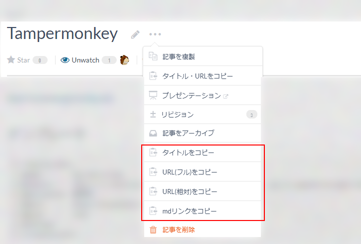

# 概要

esa.io PC版のドロップダウンメニューに、タイトル・URLを個別にコピーする機能を追加します。

# 動作確認環境

- google chrome
- windows10
- Tampermonkey

# 使い方

- ビルドをしてout/script.user.jsを作成
- ファイルをTampermonkeyにコピペ

# ビルド方法

- `npm ci`
- `npm run build`

# Licence
MIT License